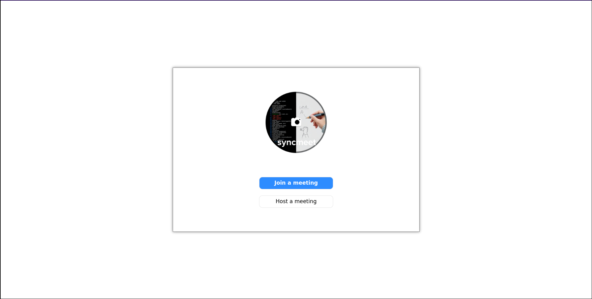
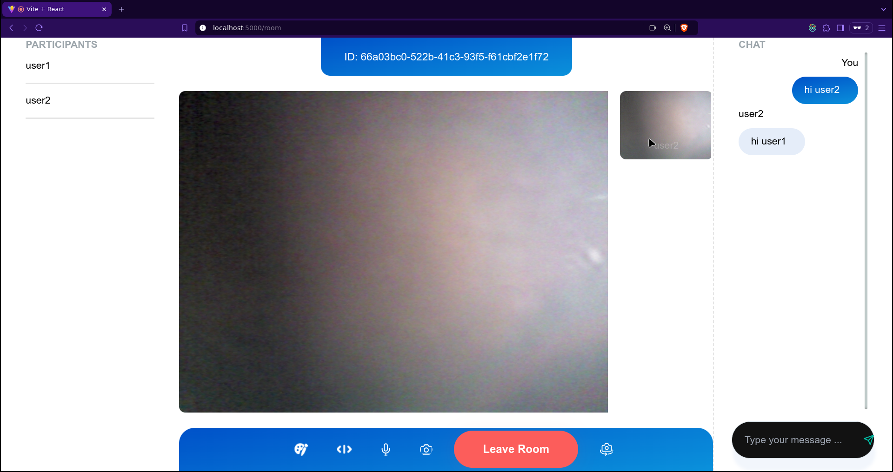
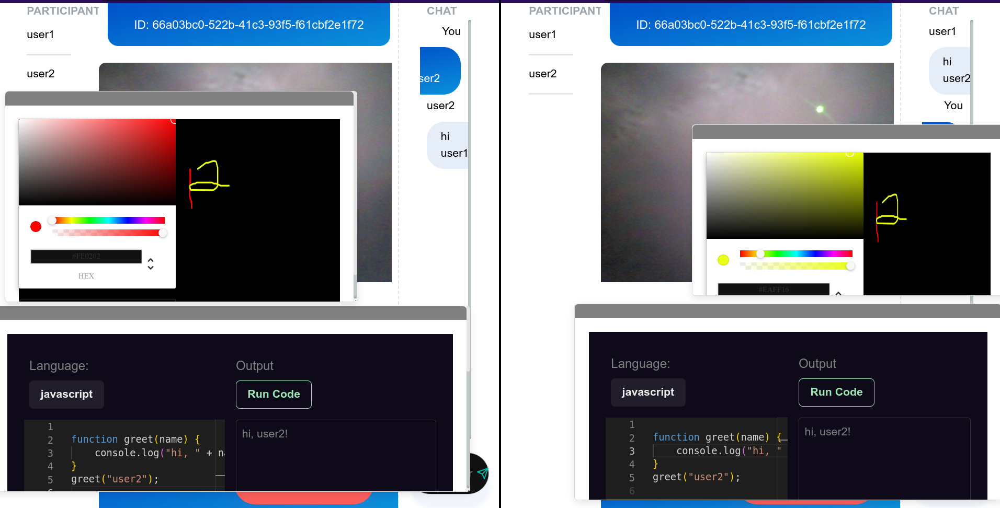

# SyncMeet

**SyncMeet** is a powerful, real-time video conferencing application that enables teams to collaborate effortlessly with live video, chat, coding, and drawing tools, all in one place.

## Demo of app





## Features

- **Group Video Conferencing**: Connect with multiple participants over a WebRTC-powered video call in a mesh architecture.
- **Integrated Chat**: Send instant messages to all participants during meetings for seamless communication.
- **Collaborative Code Editor**: Utilize the Monaco Editor in a dedicated popup to code together in real time. Every participant can see and edit the same code, ideal for pair programming, code reviews, and collaborative troubleshooting.
- **Collaborative Drawing**: Share ideas visually with a canvas component where everyone can draw and make annotations, enabling clear and visual communication.

## Routes and User Flow

1. **`/` - Home**: Choose to join an existing meeting or host a new one.
2. **`/join-room` - Join Room**: Enter the meeting ID, provided by the host, along with your display name and options like audio-only mode.
3. **`/room` - Meeting Room**: This is the main meeting area where users see each other via video, chat, and can engage in collaborative coding and drawing.

   - When a meeting is hosted, the meeting ID is displayed at the top of the page, allowing others to join by using this ID.

## Technologies Used

- **WebRTC** with **Simple-Peer**: Manages real-time video conferencing and group chat with mesh architecture, allowing all users to connect directly. While mesh architecture is suitable for smaller groups, it may be limited for scaling.
- **WebSockets**: Powers the real-time collaborative code editor and drawing canvas to synchronize changes across all participants instantly.
- **Monaco Editor**: Provides a rich code-editing experience with syntax highlighting and language support, allowing for seamless code collaboration.

## Installation and Setup

1. Clone the repository:

   ```bash
   git clone https://github.com/Revanth686/syncmeet.git
   cd syncmeet
   ```

2. Build and run the application:

   ```bash
   npm run build
   npm start
   ```

3. Access the app by visiting `http://localhost:5000` in your browser.

## Usage

1. **Host or Join a Meeting**:

   - On the home page, either host a new meeting to generate a meeting ID (displayed at the top of the meeting page) or join an existing one by entering the meeting ID provided by the host.

2. **Set Up Meeting Preferences**:

   - On the `/join-room` page, you can enter your display name and choose audio-only mode if desired.

3. **Collaborate in the Meeting Room**:
   - **Video Call**: All participants appear in the video grid, with WebRTC providing low-latency video streams. The mesh architecture allows direct signaling data exchange between participants.
   - **Chat**: Send and receive messages instantly with all participants.
   - **Code Editor**: Open the code editor popup, where everyone can view and edit the same code in real time.
   - **Drawing Canvas**: Access the drawing canvas popup, where everyone can draw and edit collaboratively.
